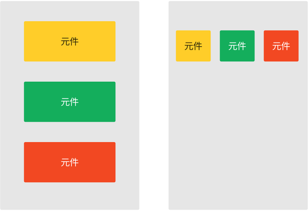
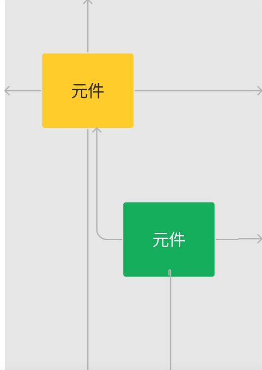
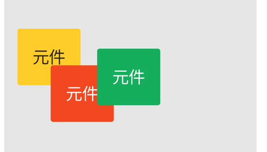
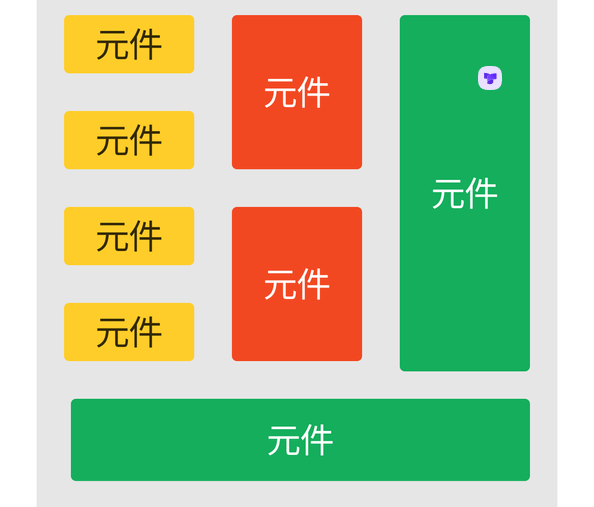
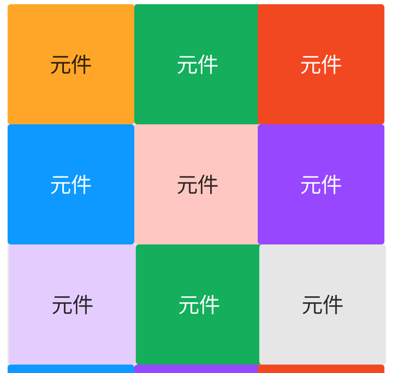

## Android Layout

### LinearLayout

元件呈垂直或水平方向排列。



``` 
<LinearLayout xmlns:android="http://schemas.android.com/apk/res/android"
    xmlns:tools="http://schemas.android.com/tools"
    android:id="@+id/main"
    android:layout_width="match_parent"
    android:layout_height="match_parent"
    android:orientation="vertical" // 垂直 水平
    android:paddingStart="50dp"
    android:paddingTop="10dp"
    tools:context=".MainActivity">
<!--    &lt;!&ndash;    android:gravity="center"&ndash;&gt;   居中-->

android:paddingStart="50dp"
android:paddingTop="10dp"

上方：top
左方：start (left)
右方：end (right)
下方：bottom
padding 控制


<!--    wrap_content 弹性的更具内容决定大小-->
<Button
    android:layout_width="wrap_content"
    android:layout_height="wrap_content"
    android:layout_gravity="center"
    android:text="@string/hello_world" />

```


### ConstraintLayout



### FrameLayout：用於元件有堆疊 (Stack)層次交錯擺放的需求。


### TableLayout：將元件放在表格中，表格可以有多行多列方式呈現。


### GridLayout：將元件放在網格中，網格有可以有多行多列方式呈現。如：Instagram、小紅書首頁顯示貼文方式。
